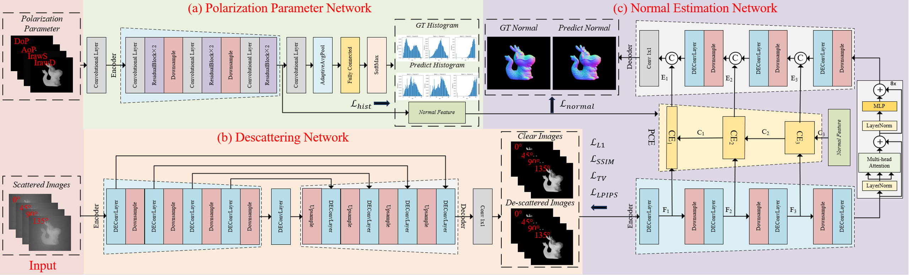

# UD-SfPNet
Repository for paper ["UD-SfPNet: An Underwater Descattering Shape-from-Polarization Network for 3D Normal Reconstruction"]()

---

## ✨ Network

<p align="center">
  
</p>

---

## 📦 Requirements

* Python >= 3.9
* PyTorch >= 1.9
* CUDA (recommended for GPU acceleration)
* Install dependencies:

  ```bash
  pip install -r requirements.txt
  ```
  

---

## 🚀 Usage

### 1. Clone the repository

```bash
git clone https://github.com/WangPuyun/UD-SfPNet.git
cd UD-SfPNet
```

### 2. Train the model

```bash
python train.py
```

### 3. Evaluate / Visualization

You can directly use our [pretrained models]() for evaluation and visualization without retraining.

To evaluate the surface normal maps and visualize the corresponding angular error, you can use the `Angle_error_map.py` script. This script performs two main tasks:

1. It generates the **surface normal map** from the input data.
2. It creates a **per-pixel angular error color map** that visualizes the angular error between the ground truth normal and the predicted normal.


```bash
python Angle_error_map.py
```

---


## 🙏 Acknowledgements
This work partially uses the implementation from the following open-source project:

- [DEA-Net: Single image dehazing based on detail-enhanced convolution and content-guided attention](https://github.com/cecret3350/DEA-Net.git)
- [Deep Color Consistent Network for Low Light-Image Enhancement](https://github.com/Ian0926/DCC-Net.git)
- [Shape from Polarization for Complex Scenes in the Wild](https://github.com/ChenyangLEI/sfp-wild.git)

We sincerely thank the authors for open-sourcing their code and making this research possible.


---


## 🤝 Citation

If you find our work useful in your research, please consider citing:
```bibtex

```